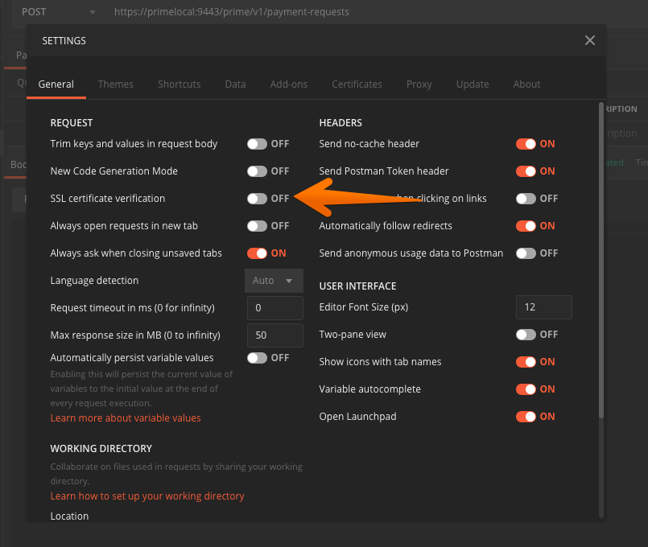
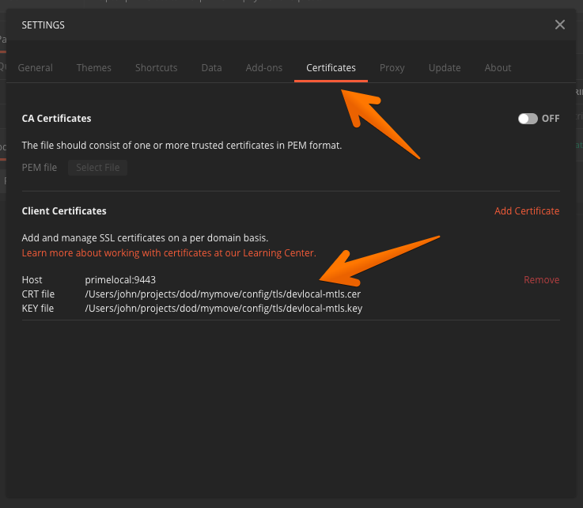
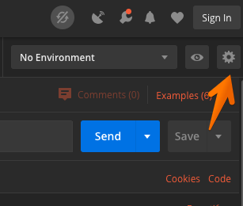
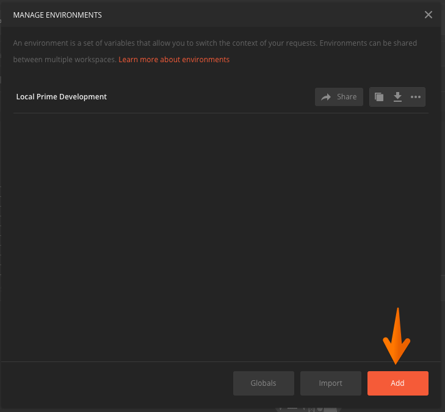
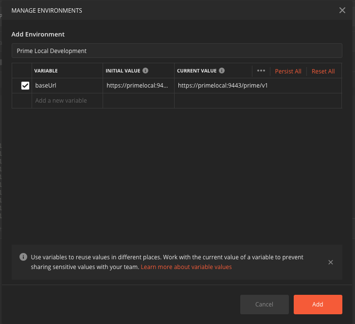
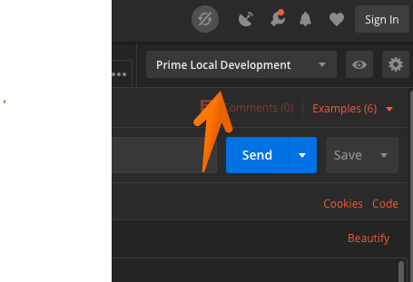

## Set Up Postman for Mutual TLS
If you are planning to use [Postman](https://www.getpostman.com/) for testing the api you will need to make the following changes to support Mutual TLS.

### General Postman Settings

Open the general settings panel by clicking the wrench icon in the upper left corner

Under the _General_ tab turn off **SSL certificate verification**

Switch to the **Certificates** tab and add the development certificate with the following settings:

* **Host** `primelocal`
* **Port** `9443`
* **CRT File** `config/tls/devlocal-mtls.cer`
* **KEY File** `config/tls/devlocal-mtls.key`

### Postman Environment settings

You will need to configure the base url for development or other environment you plan to connect to. Click on the gear icon near the environment pull down in the upper right of the application.

This will open the _Manage Environments_ dialog. Select **Add** in the lower right corner

Fill in the following details in the add new dialog and click **Add**

* **Variable** `baseUrl`
* **Initial Value** `https://primelocal:9443/prime/v1`
* **Current Value** `https://primelocal:9443/prime/v1`

Once you have added this environment and closed the dialog select the new environment from the pull down.

